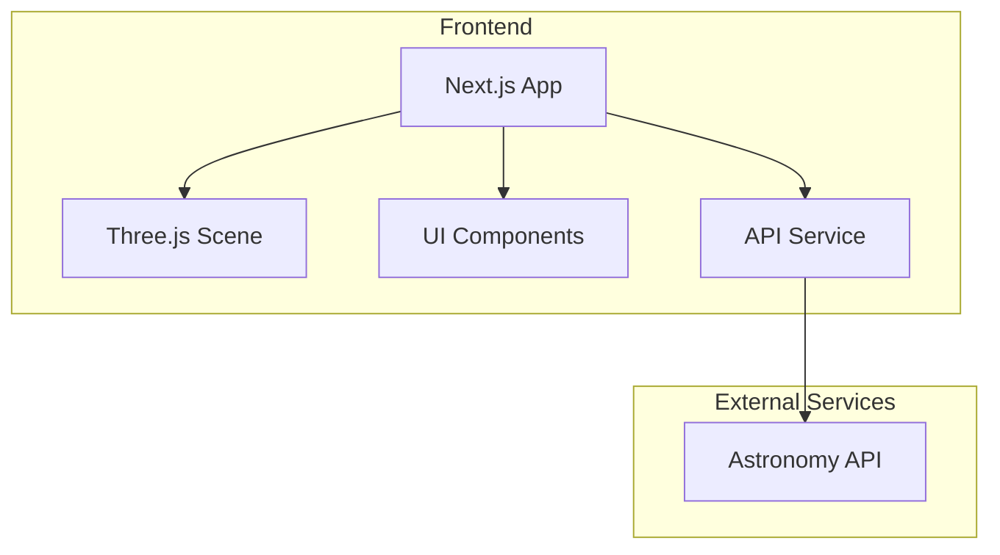

# 3D太阳系星体运动可视化网站 - 技术架构文档

## 1. Architecture Design



## 2. Technology Description

| Layer | Technology | Version |
|-------|------------|---------|
| Frontend Framework | Next.js | 14.x |
| 3D Rendering | Three.js | 0.160.x |
| Styling | Tailwind CSS | 3.x |
| Package Manager | pnpm | 8.x |

## 3. Route Definitions

| Route | Purpose | File Path |
|-------|---------|-----------|
| `/` | 主页 - 3D太阳系可视化 | `app/page.tsx` |

## 4. API Definitions

### 4.1 天文数据API

**接口来源**: NASA Solar System Open Data / OpenSky API

**数据模型**:
```typescript
interface PlanetData {
  id: string;
  name: string;
  nameCN: string;
  diameter: number;           // 直径 (km)
  mass: number;              // 质量 (kg)
  distanceFromSun: number;   // 距太阳距离 (AU)
  orbitalPeriod: number;     // 公转周期 (地球日)
  rotationPeriod: number;    // 自转周期 (小时)
  orbitalRadius: number;     // 轨道半径 (场景单位)
  eccentricity: number;      // 轨道偏心率
  inclination: number;       // 轨道倾角
  color: string;             // 行星颜色
  hasRings: boolean;         // 是否有光环
}
```

### 4.2 本地数据文件

由于免费天文API获取实时位置数据较为复杂，项目将使用预定义的行星数据文件，并模拟实时运动。

**文件路径**: `data/planets.ts`

## 5. Component Structure

```
src/
├── app/
│   ├── page.tsx          # 主页面
│   └── layout.tsx        # 布局组件
├── components/
│   ├── SolarSystem.tsx   # 3D太阳系场景组件
│   ├── ControlPanel.tsx  # 控制面板组件
│   ├── InfoPanel.tsx     # 行星信息面板
│   └── StarField.tsx     # 星空背景组件
├── hooks/
│   └── useSolarSystem.ts # 太阳系状态管理
├── data/
│   └── planets.ts        # 行星数据
├── utils/
│   └── api.ts            # API工具函数
└── styles/
    └── globals.css       # 全局样式
```

## 6. Data Model

### 6.1 行星数据结构

| 字段 | 类型 | 说明 |
|------|------|------|
| id | string | 行星唯一标识 |
| name | string | 英文名称 |
| nameCN | string | 中文名称 |
| diameter | number | 直径(km) |
| mass | number | 质量(kg) |
| distanceFromSun | number | 距太阳距离(AU) |
| orbitalPeriod | number | 公转周期(地球日) |
| rotationPeriod | number | 自转周期(小时) |
| orbitalRadius | number | 轨道半径(场景单位) |
| eccentricity | number | 轨道偏心率 |
| inclination | number | 轨道倾角 |
| color | string | 行星颜色 |
| hasRings | boolean | 是否有光环 |

### 6.2 状态管理

```typescript
interface SolarSystemState {
  isPlaying: boolean;
  animationSpeed: number;
  selectedPlanet: PlanetData | null;
  cameraPosition: { x: number; y: number; z: number };
}
```

## 7. 3D场景技术要点

- **场景**: THREE.Scene，深色背景
- **相机**: THREE.PerspectiveCamera，位置(0, 20, 50)
- **控制器**: OrbitControls，支持拖拽旋转、缩放
- **光照**: PointLight模拟太阳，AmbientLight环境光
- **行星**: Mesh + SphereGeometry + MeshStandardMaterial
- **轨道**: Line + CircleGeometry
- **星空**: Points + BufferGeometry + PointsMaterial

## 8. 性能优化策略

- 使用InstancedMesh渲染大量星星
- 行星纹理使用合适分辨率
- 动画使用requestAnimationFrame
- 相机距离远时降低细节级别
- 使用LOD(Level of Detail)技术